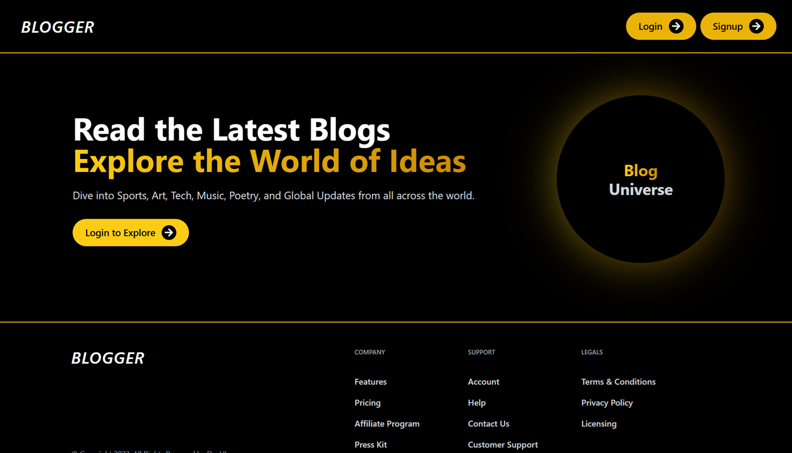
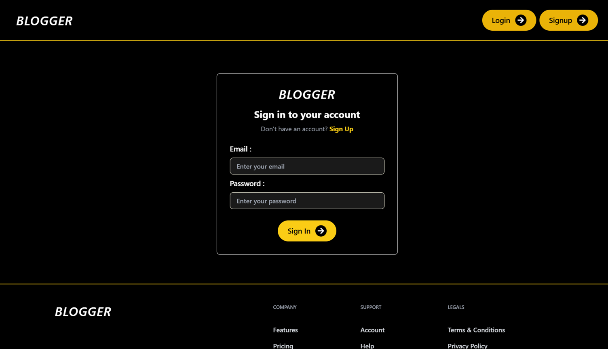
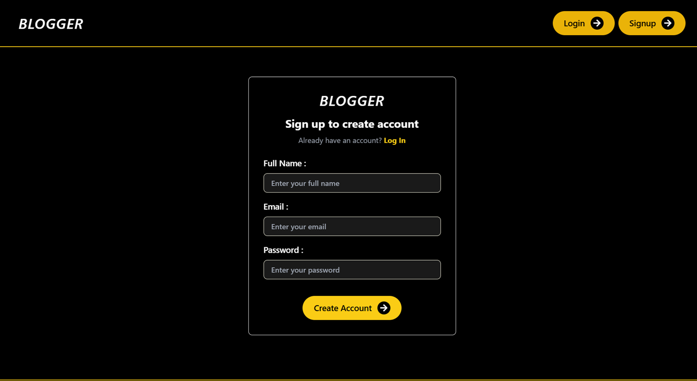
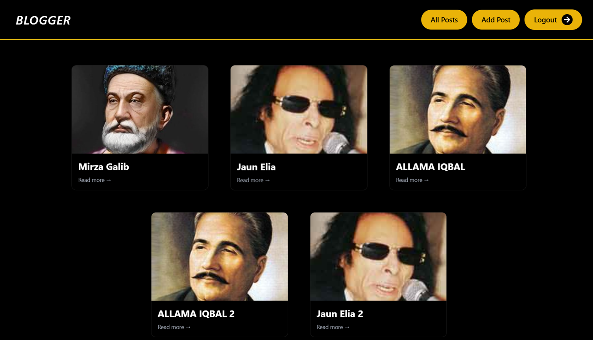
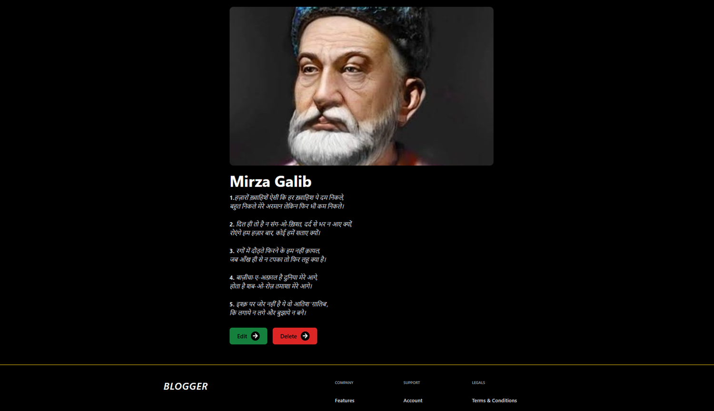
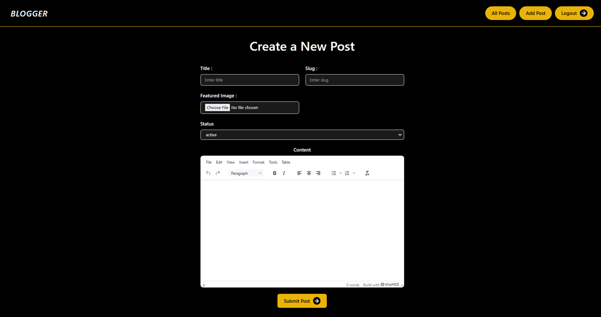

# 🖋️ **Full-Stack Appwrite Blog Application**

**[Live Demo](https://full-stack-blog-app-one.vercel.app/)**

**Full-Stack Appwrite Blog Application** is a modern, feature-rich blogging platform built using **Appwrite** for backend services and **React** with **Tailwind CSS** for the frontend. This application provides a seamless experience for users to create, explore, and manage blog posts with ease. It includes user authentication, rich text editing, image uploading, and dynamic post management.

---

## 🔥 **Key Features**

- **User Authentication**: Secure login and signup functionality using Appwrite's authentication system.
- **Animated UI**: Smooth animations and transitions powered by Tailwind CSS.
- **Create Posts**: Users can add posts with a title, automatically generated slugs (editable), and rich text content using **TinyMCE**.
- **Image Uploading**: Users can upload images for their blog posts.
- **Explore Posts**: Browse and read blog posts from all users.
- **Edit & Delete Posts**: Users can only modify or delete their own posts.
- **Responsive Design**: Fully optimized for mobile, tablet, and desktop devices.
- **Logout**: Secure logout functionality to end the session.

---

## 🖼️ **Screenshots (Desktop)**

### Home Page

### Login Page

### Signup Page

### All Post Page

### Single Post Page

### Add Post Page

### Mobile UI

| **Home Page**                                          | **Login Page**                                           | **All Posts Page**                                              |
| ------------------------------------------------------ | -------------------------------------------------------- | --------------------------------------------------------------- |
|  |  |  |

| **Add Post Page**                                                | **Edit Post Page**                                              | **Single Post Page (Admin View)**                                        |
| ---------------------------------------------------------------- | --------------------------------------------------------------- | ------------------------------------------------------------------------ |
|  |  |  |

## 🛠️ **Built With**

- **Frontend**: React, Tailwind CSS
- **Backend**: Appwrite (Authentication, Database, Storage)
- **Rich Text Editor**: TinyMCE
- **Routing**: React Router
- **State Management**: Redux Toolkit
- **Deployment**: Vercel

---

## 🎥 **Video Walkthrough**

Watch the full demo on LinkedIn to see the project in action:  

